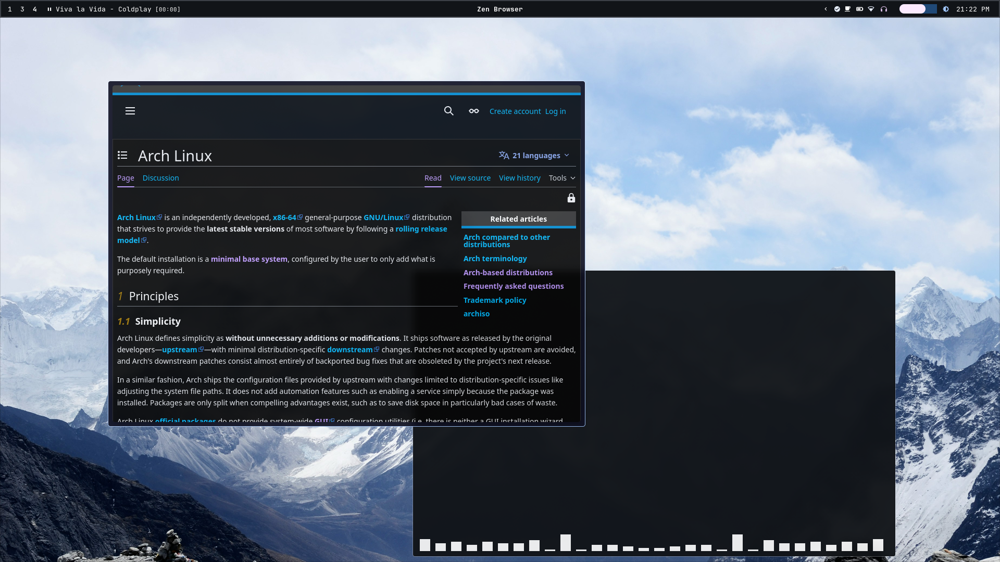
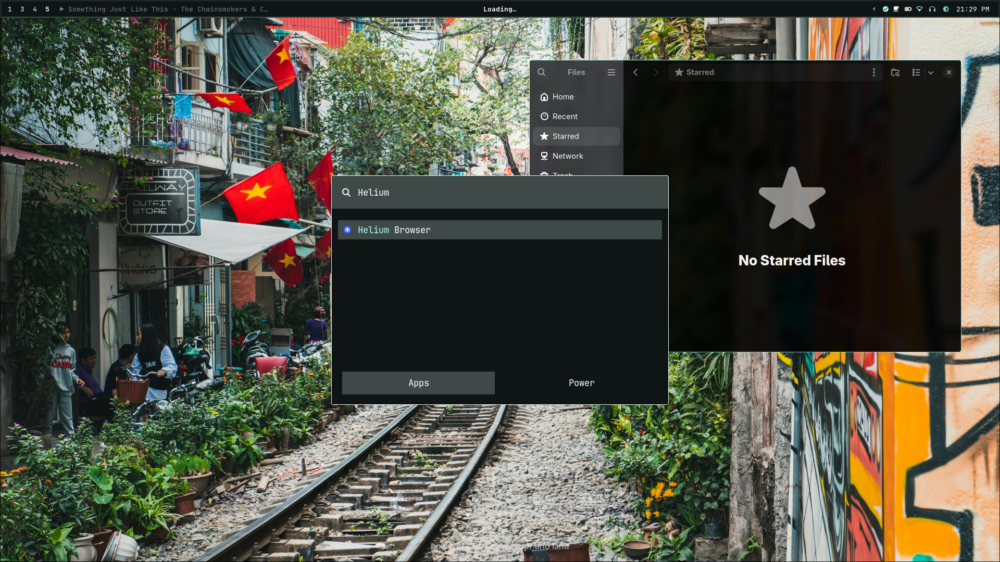
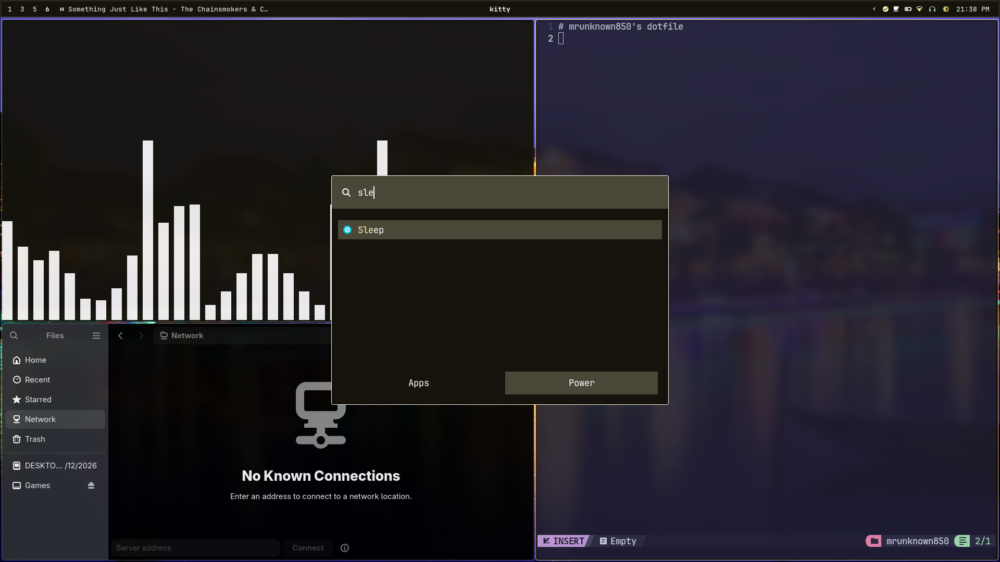

  <h1>MrUnknown850's dotfile</h1>
  <h3>Simple - Minimal - Practical</h3>

> [!WARNING]
> Hyprland 0.55 and above only: Due to the recent deprecation of Hyprlang, it is required that you update to Hyprland 0.55 and above. For distributions that have not shipped the needed version, consider building Hyprland from [source](https://github.com/hyprwm/hyprland).

## Screenshots

## 0. Table of content
## 1. What is it?
Configuration files that happens to come with automated system setup script. Utilising [archinstall](https://wiki.archlinux.org/title/Archinstall), a fully battery-packed system can be deployed with minimal user interaction.
> [!WARNING]
> The current setup is very crude. Despite the simple setup process, the use of terminal is still required for deeper customisation.

What's included?
- System pacmages: pipewire, ufw, bluetooth, tlp,...
- Hypr* suite.
- Material 3 design with color scheme generated from [matugen](https://github.com/InioX/matugen)

| Category | App | Category | App |
|:--- |:--- |:--- |:--- |
| Shell | zsh | WM | Hyprland |
| Editor | neovim | Terminal | kitty |
| Launcher | rofi | Statusbar | waybar |
| File Manager | nautilus | Notification Daemon | mako |

## 2. Installation
## 3. Licenses
